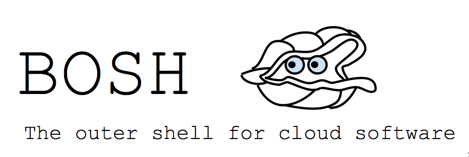
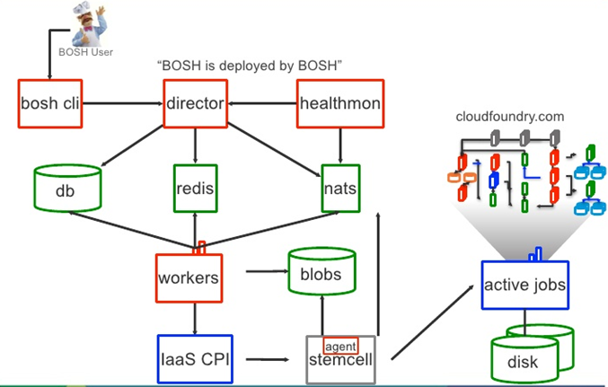

# Treading Water: Getting Started with BOSH

---

## How do we manage PivotalCF?

PivotalCF is for the benefit of developers and business goals.

**Questions:**

* How we keep PivotalCF running?
* How to upgrade? Scale upwards? Heal?

**Answer:** BOSH!

---

## Simply put, what is BOSH?

> BOSH is an open framework for managing the full development and deployment life cycle of large-scale distributed software applications.

* All PivotalCF components are packaged as BOSH releases
* PivotalCF is then deployed using BOSH

For information about individual packages and jobs, please refer to the CF Release
repository:  
<https://github.com/cloudfoundry/cf-release>

---

## BOSH Infrastructure

 
<small>Image credit: <http://blog.csdn.net/u013631384/article/details/27971737>

---

## For more information

Want to more information or to schedule a training? [Contact us](http://starkandwayne.com/contact-us.html) today!
