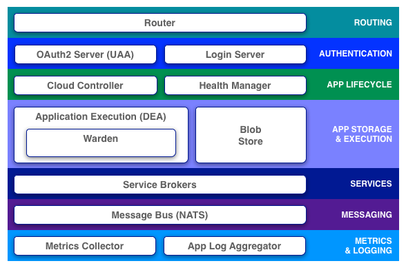

# PivotalCF Architecture

---

## Components

---

## Router

* Routes requests
 * myapp.com =&gt; random app instance/container
* Balances load across DEAs
* Maintains routing table in real time based on status of app instances
* In the event of failure, retries request with new instance of same application

---

## Authentication

OAuth2 server (UAA) works with the login server to manage identity.
The UAA can:

* Authenticate users with their CF credentials
* Act as an SSO service using those credentials
* Issue tokens for applications when they act on behalf of CF users

---

## Cloud Controller (CC)

* The "brain" - controls/orchestrates all other components
* Stores status information for other components, users, applications, and available services
* Exposes REST interface for CLI commands
* Binds external services (e.g. RabbitMQ, MongoDB) to the deployed applications

---

## For more information

Want to more information or to schedule a training? [Contact us](http://starkandwayne.com/contact-us.html) today!
