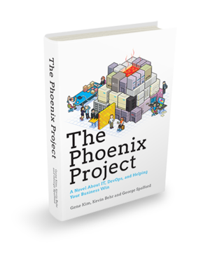

# PivotalCF Landscape

---

---

## The Problem

Traditionally the app development cycle involves:

* Provisioning new environments
* Reproducing, testing, scaling environments
* Lengthy deploys
* Developers "writing apps" instead of "running services"
* IT deploying apps that they don't understand
* Resource utilization/optimization
* Supporting 100s+ of diverging environments
* Slow feedback cycle to customers

---

## Platform Solution

"Platform as a Service":

* Rapid deploys (no separate IT department required!)
* Self-provisioning of new environments
* Fast, easy scaling - even for 100s of environments and apps
* Supports many backend services, e.g. RabbitMQ, MySQL, MongoDB, Redis
* Consistent UX on any cloud platforms, e.g. Amazon, Rackspace, OpenStack

---

## Case Study

* Jonathan Murray, CTO of WMG
* From Zero to Factory: Revolutionizing 'Time-to-Value'
* [Platform Conference](http://www.youtube.com/watch?v=LIg7TO0CaKA)

---

## For more information

Want to more information or to schedule a training? [Contact us](http://starkandwayne.com/contact-us.html) today!
