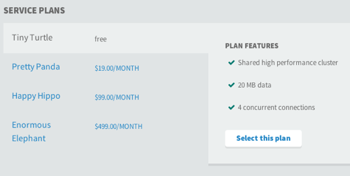
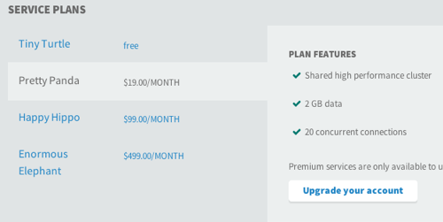

# PivotalCF Services

---

## What are Services?

Services are any applications or programs used by Applications.

Common services include:

- databases
- message queues
- email services
- 3rd party APIs

---

## Services and Pivotal CF

- Externally managed outside of Pivotal CF
- Registers plans via

	- Service Plan Catalog
- Uses a binding model via a "Broker"
- Well defined API contract

---

## Service Plans

- Are retrieved by Cloud Controller from the Service Broker
- When a plan is requested by an application a service instance is created

Example plan:

 

---

## For more information

Want to more information or to schedule a training? [Contact us](http://starkandwayne.com/contact-us.html) today!
